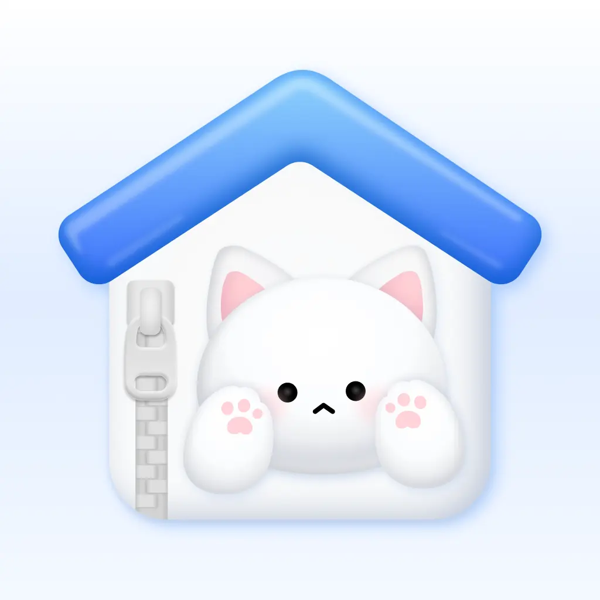
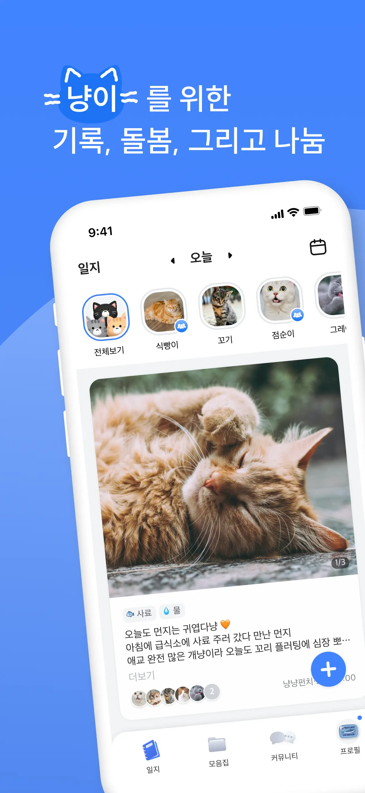
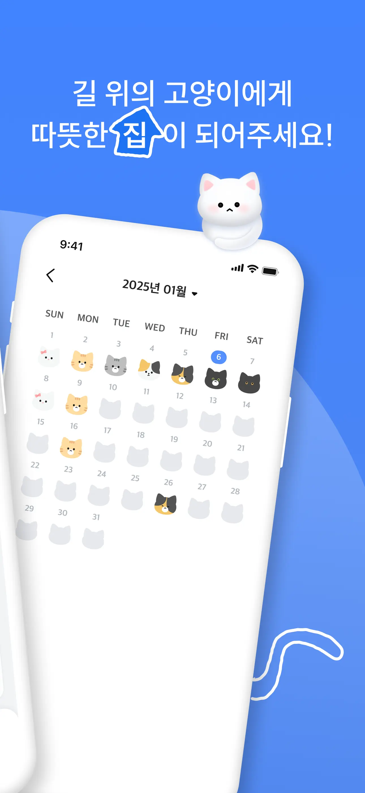
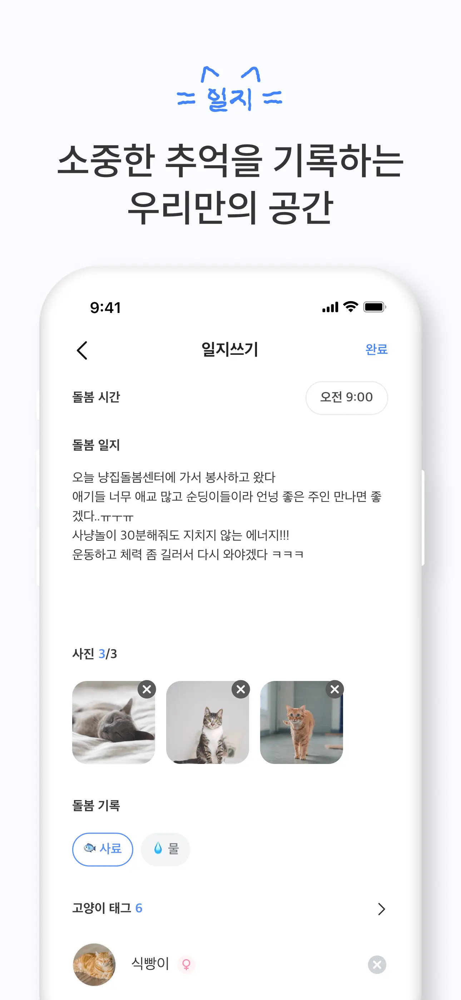
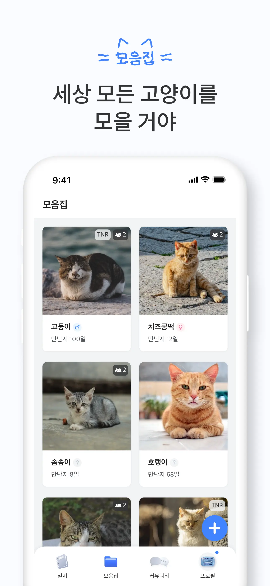
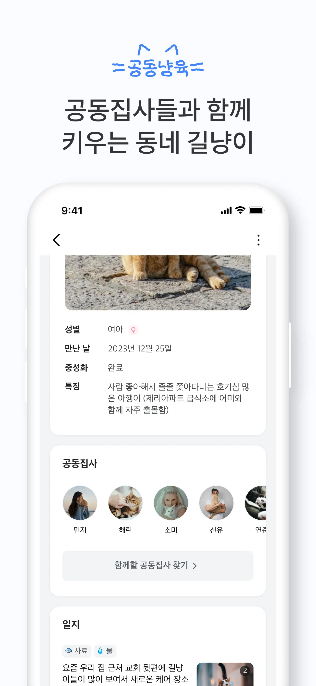
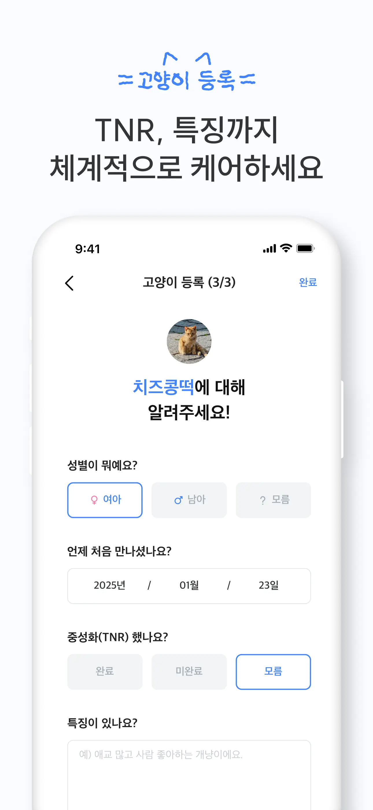

  
  
  # 🐱 냥.zip
  
  **길고양이 케어테이커들을 위한 종합 돌봄 일지 서비스**

### 📱 냥.zip이 뭐에요?

  

## 🎯 프로젝트 소개

**냥.zip**은 길고양이를 돌보는 케어테이커들을 위한 **모바일 웹앱 서비스**입니다. 체계적인 돌봄 기록과 케어테이커 간의 협업을 통해 더 나은 길고양이 돌봄 환경을 제공합니다.

### ✨ 주요 기능

#### 🐾 **고양이 모음집**
- 길고양이 프로필 등록 및 상세 정보 관리
- 고양이별 건강상태, 특징, 위치 정보 기록
- 프로필 이미지 업로드 및 갤러리 관리

#### 📝 **돌봄 일지**
- 일별/시간별 돌봄 활동 상세 기록
- 사료 급여, 건강 체크, 특이사항 등 다양한 활동 로깅
- 사진 첨부를 통한 시각적 기록 관리
- 캘린더를 통한 돌봄 히스토리 조회

#### 👥 **공동 냥육**
- 다른 케어테이커와의 협업 시스템
- 돌봄 일정 공유 및 역할 분담
- 실시간 알림을 통한 소통

#### 💬 **커뮤니티**
- 케어테이커들 간의 정보 공유 플랫폼
- 피드 작성, 댓글, 좋아요, 북마크 기능
- 돌봄 팁 및 경험 공유

#### 🔔 **스마트 알림**
- 돌봄 일정 리마인더
- 협업 케어테이커 활동 알림
- 커뮤니티 상호작용 알림

## 🌟 특별한 점

### 🎯 **길고양이 특화**
일반 펫케어 앱과 다르게 **길고양이 돌봄에 특화**된 기능들을 제공합니다. 위치 기반 정보, 야외 환경 고려사항, TNR 관리 등 길고양이만의 특수한 니즈를 반영했습니다.

### 🤝 **협업 중심**
혼자서는 어려운 길고양이 돌봄을 **여러 케어테이커가 함께** 할 수 있도록 설계되었습니다. 실시간 소통과 역할 분담으로 더 나은 돌봄 환경을 만듭니다.

### 📱 **사용자 친화적**
복잡한 기능보다는 **직관적이고 쉬운 사용성**에 집중했습니다. 모든 연령대의 케어테이커가 부담 없이 사용할 수 있습니다.

## 🚀 프로젝트

### 📂 **레포지토리**
- **[📱 Frontend](https://github.com/meowzip/meowzip-front)** - Next.js 기반 웹/모바일 앱
- **[🛠 Backend](https://github.com/meowzip/meowzip-backend)** - 서버 API 및 데이터베이스

### 🎯 **서비스 링크**
- **[📱 앱스토어](https://apps.apple.com/app/meowzip)** - iOS 앱 다운로드 (준비 중)
- **[🤖 플레이스토어](https://play.google.com/store/apps/details?id=com.meowzip)** - Android 앱 다운로드 (준비 중)

## 🤝 함께하기

### 💝 **기여 방법**
- **코드 기여**: 각 레포지토리에서 이슈 및 Pull Request
- **피드백**: 서비스 사용 후 개선사항 제안
- **커뮤니티**: 길고양이 돌봄 경험 및 노하우 공유

### 🏢 **팀 정보**
- **이메일**: meowzzip@gmail.com

---

  
**🐱 모든 고양이들의 행복한 삶을 위해 🐱**

*고양이를 사랑하는 모든 분들과 함께 만들어가는 서비스입니다*

**Made with ❤️ by Meowzip Team**

---
